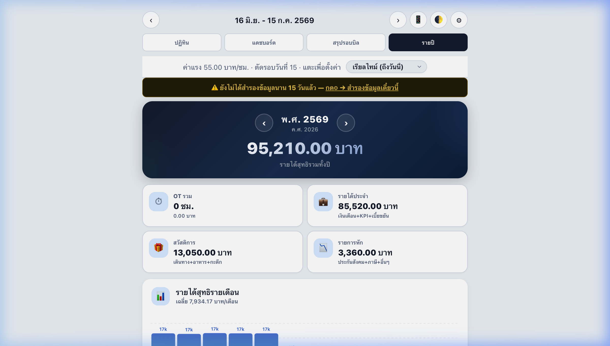
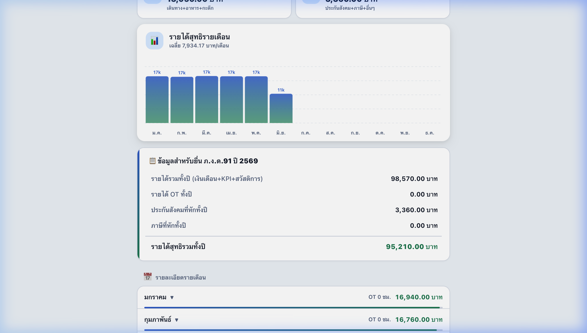
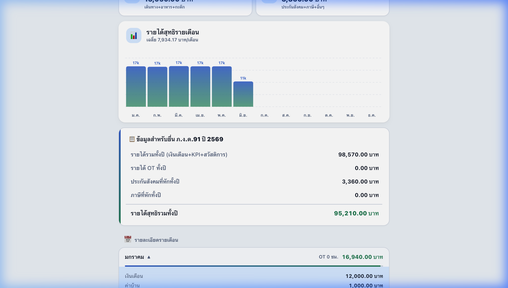
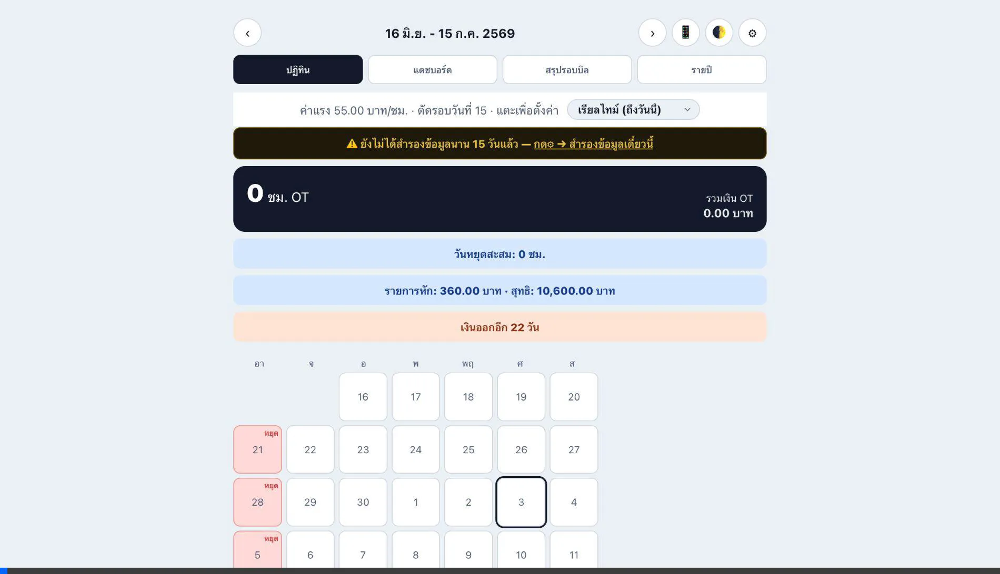

# Walkthrough — รีดีไซน์หน้าสรุปรายปี ✅

## สรุปการเปลี่ยนแปลง

แก้ไข 3 ไฟล์ (ไม่แตะ `calc.js` หรือ `data.js`):

| ไฟล์ | การเปลี่ยนแปลง |
|------|---------------|
| [index.html](../index.html) | ปรับ `<section id="annualPage">` ใหม่ทั้งหมด |
| [style.css](../css/style.css) | เพิ่ม CSS ~170 บรรทัดสำหรับ premium design |
| [ui.js](../js/ui.js) | แก้ `renderAnnual()` + เพิ่ม `drawAnnualBarChart()` |

---

## ผลลัพธ์

### Hero Header + Stats Cards

### Bar Chart + Tax Card + Monthly Breakdown

### Expandable Monthly Detail

### บันทึกการทดสอบ

---

## สิ่งที่ทดสอบแล้ว

- ✅ Hero Header แสดงปี พ.ศ./ค.ศ. และยอดสุทธิรวม
- ✅ Stats Cards 4 ใบแสดงข้อมูลถูกต้อง (OT, รายได้ประจำ, สวัสดิการ, รายการหัก)
- ✅ Bar Chart 12 เดือนแสดง gradient bars + ตัวเลขบนแท่ง
- ✅ Tax Card (ภ.ง.ด.91) แสดงครบทุกรายการ + gradient accent
- ✅ Monthly Breakdown — กดเพื่อ expand/collapse ดูรายละเอียด + mini progress bar
- ✅ ปุ่มเลื่อนปี ‹ › ทำงานปกติ
- ✅ Dark Mode รองรับอัตโนมัติผ่าน CSS variables
- ✅ Print CSS อัพเดทแล้ว
- ✅ ไม่แตะ calc.js / data.js — สูตรคำนวณไม่เปลี่ยน
