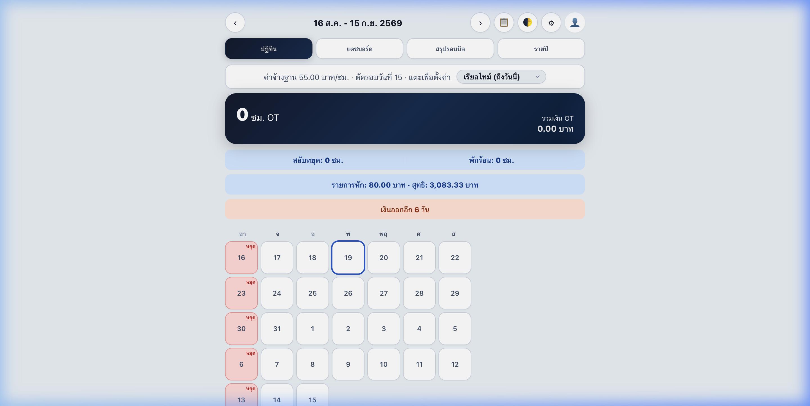
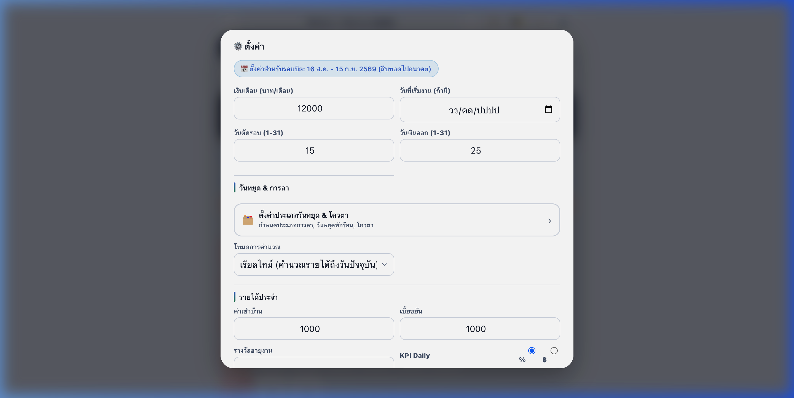

# Impeccable UI Overhaul (World-Class Redesign)

การยกระดับ UI ของแอป Payrolls จากแบบ "ใช้งานได้" ให้กลายเป็น "พรีเมียมและสวยงามระดับโลก"

## 🎨 สิ่งที่เปลี่ยนแปลง (Changes Made)

1. **Ambient Background:**
   - เปลี่ยนพื้นหลังให้มี **Radial Gradients** เรืองแสงบางๆ ทั้งฝั่งซ้าย (สีน้ำเงิน) และขวา (สีส้ม) เพื่อลบความน่าเบื่อของพื้นหลังแบบทึบ
   - ปรับ Custom Scrollbar ให้มีความหนาบางและสีที่เข้ากับธีมแอปมากขึ้น

2. **Glassmorphism Modals (หน้าต่างป๊อปอัป):**
   - **บน Desktop:** ปรับ `.sheet` ให้เด้งขึ้นมา **กลางจอ** พร้อมเงาที่นุ่มลึก และเพิ่มพื้นหลังเบลอ (Backdrop Blur) ทำให้เหมือนแผ่นกระจกที่ลอยอยู่เหนือแอป
   - **บน Mobile:** คงความสะดวกในการใช้งานมือเดียว (Bottom Sheet) ไว้ แต่เพิ่มขอบมน และแอนิเมชันให้ลื่นไหลขึ้น

3. **Premium Inputs & Buttons:**
   - **Inputs & Selects:** เพิ่มขอบเรืองแสงสีฟ้า (Focus Ring) พร้อมสเกล (Scale up) เล็กน้อยเวลากดพิมพ์
   - **Radio/Checkbox:** ปรับแต่งให้เวลาติ๊กเลือก (Checked) จะมีแอนิเมชันขยายตัว (Scale) และแสดงสีที่เน้นชัดเจน
   - **Buttons:** เปลี่ยนจังหวะการกดปุ่มให้มีเอฟเฟกต์ "บุ๋ม" (Scale down) เพื่อให้ความรู้สึกของการคลิกที่สมจริง

## 📸 ภาพตัวอย่าง

### Dashboard (หน้าหลัก)

*(สังเกตแสง Ambient Gradient ด้านซ้ายและขวา)*

### Settings Modal (หน้าตั้งค่า - Glassmorphism)

*(หน้าต่างอยู่ตรงกลางบน Desktop พร้อมความโปร่งแสง และดีไซน์ช่องกรอกที่สวยงามขึ้น)*

## 🔒 ข้อมูลทางเทคนิค
- **ไฟล์ที่แก้ไข:** `css/style.css`, `index.html` (อัปเดตเวอร์ชัน cache)
- **Cache Busting:**
  - `style.css?v=138`
  - `sw.js` (CACHE = `ot-v44`)
- **ไม่กระทบ Logic:** โค้ดคำนวณใน JavaScript ทั้งหมดยังคงทำงานได้ถูกต้อง 100%
